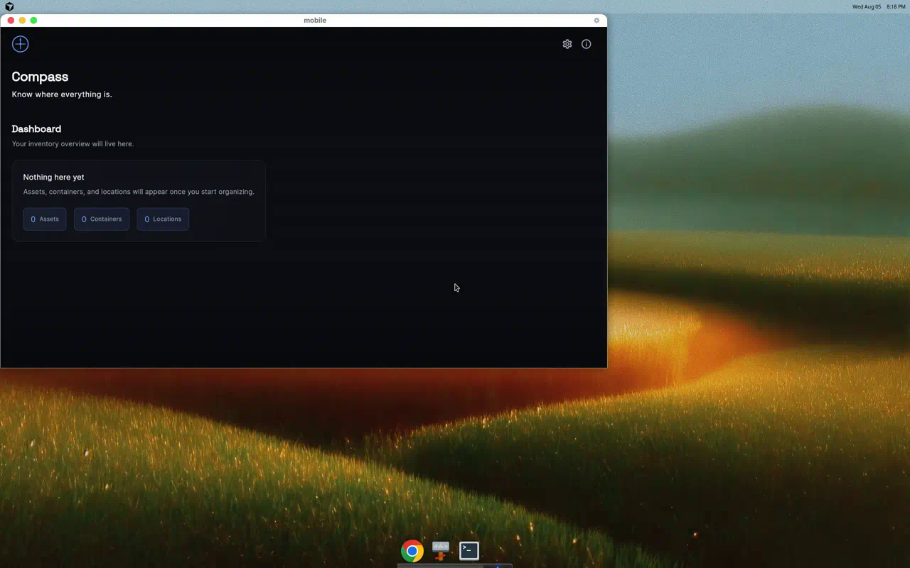
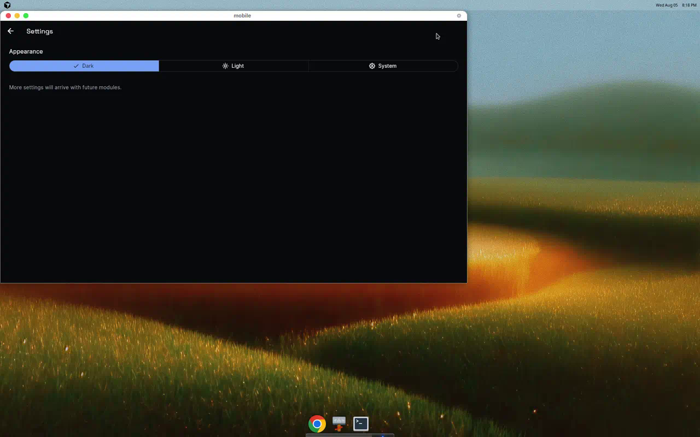
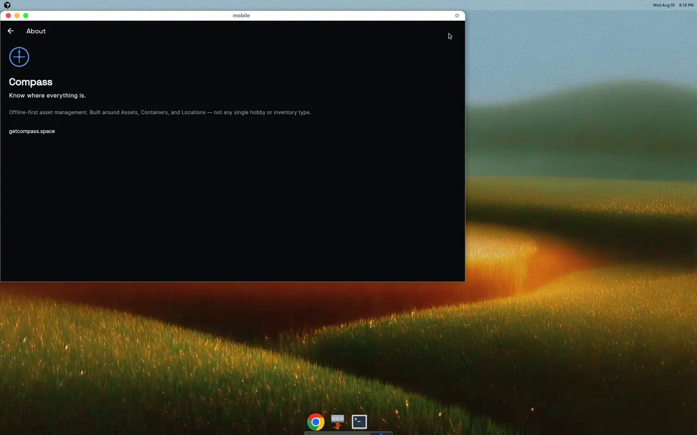

# Compass Mobile

Offline-first asset management for iOS, Android, and desktop.

**Compass** — *Know where everything is.*

## Prerequisites

### Install Flutter (stable)

```bash
# macOS (Homebrew)
brew install --cask flutter

# Or clone the SDK
git clone https://github.com/flutter/flutter.git -b stable
export PATH="$PATH:`pwd`/flutter/bin"
```

Verify:

```bash
flutter doctor
```

Use the **stable** channel. This project targets Dart 3.12+ / Flutter 3.44+.

## Setup

```bash
cd apps/mobile
flutter pub get
```

Generate Freezed / Drift / JSON code after changing annotated models:

```bash
dart run build_runner build --delete-conflicting-outputs
```

## Run

```bash
flutter run
```

Pick a device when prompted, or target one explicitly:

```bash
flutter run -d chrome      # web
flutter run -d macos      # macOS
flutter run -d linux      # Linux
flutter run -d <deviceId> # iOS / Android
```

## Supported platforms

| Platform | Status |
|----------|--------|
| iOS      | Supported |
| Android  | Supported |
| macOS    | Supported |
| Linux    | Supported |
| Windows  | Supported |
| Web      | Supported (dev / preview; requires `web/sqlite3.wasm` + `web/drift_worker.js`) |

## Architecture overview

Clean Architecture, feature-first:

```
lib/
├── core/                 # Shared kernel
│   ├── constants/
│   ├── domain/           # Entities + repository contracts
│   ├── errors/
│   └── utils/
├── features/             # Vertical slices
│   ├── assets/
│   ├── containers/
│   ├── locations/
│   ├── home/
│   ├── splash/
│   ├── settings/
│   └── about/
│       ├── presentation/
│       ├── application/
│       ├── domain/
│       └── infrastructure/
├── database/             # Drift SQLite + migrations
├── routing/              # GoRouter
├── theme/                # Material 3 tokens (dark-first)
├── services/             # Cross-cutting services
├── shared/               # Providers, shared infrastructure
└── widgets/              # Reusable UI primitives
```

### Layers

| Layer | Responsibility |
|-------|----------------|
| **presentation** | Widgets, pages — no business logic |
| **application** | Use cases / services, Riverpod notifiers |
| **domain** | Entities, value objects, repository interfaces |
| **infrastructure** | Drift DAOs, repository implementations |

### Core domain

The platform is built around generic concepts — never module-specific fields:

`Asset` · `Container` · `Location` · `AssetType` · `Movement` · `Relationship` · `History` · `Tag` · `Metadata` · `Photo`

Module-specific data (MTG, jewelry, tools, …) belongs in `Metadata`, not the core schema.

### Stack

- **Flutter** + Material 3
- **Riverpod** / **hooks_riverpod** + **flutter_hooks**
- **GoRouter**
- **Drift** (SQLite)
- **Freezed** + **json_serializable** + **build_runner**
- **uuid**
- **very_good_analysis**

### Quality

```bash
flutter analyze
flutter test
```

## Notes

- Database schema ships empty in this foundation milestone; migration hooks are ready.
- Repository interfaces are wired to in-memory implementations until tables land.
- Do not put business logic in widgets.

## UI captures

Foundation layout stills from a Linux desktop run (iteration references, not
marketing heroes). Full set: [`docs/images/mobile/`](../../docs/images/mobile/).

### Home



### Settings



### About


